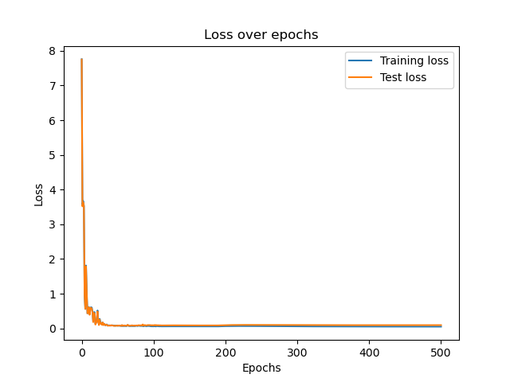
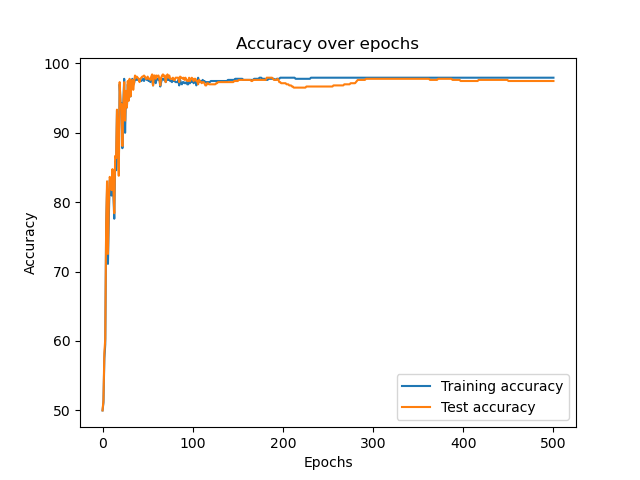
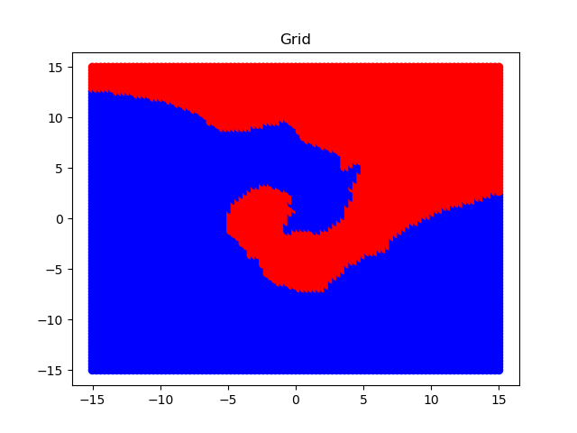
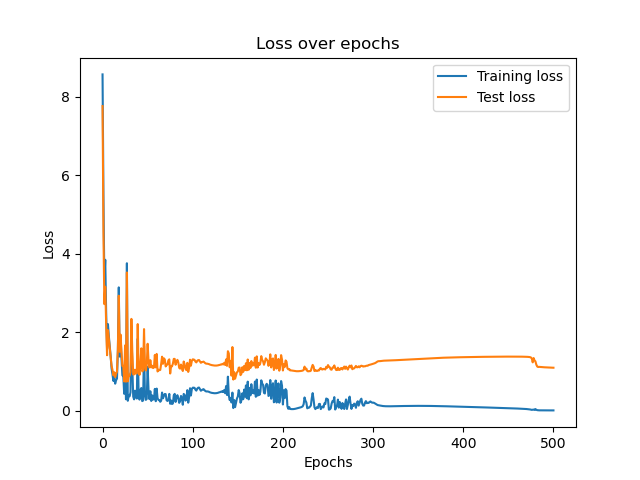
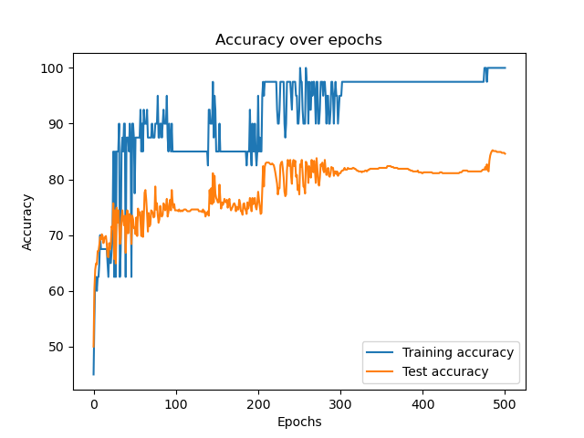
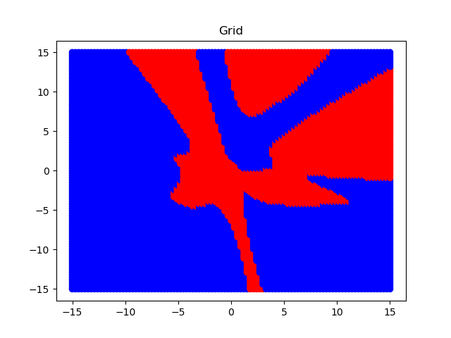

# Report

## Hyperparameters

1. Learning rate is: `0.1`
    - I used constant learning rate over the course of training
2. Number of nodes in the hidden layer is: `250`
3. Number of hidden layers: `1`
    - The structure looks like this: 
        **input_layer**(2 nodes) - **hidden_layer**(250 nodes) - **output_layer**(1 node)
4. Number of epochs is: `500`

## Training accuracy and loss

### Whole train data set
- For the Neural Network(NN) that was trained on the whole training set 
I obtained the following results: 
 
 
As for the grid, it looks like this: 
 
- Train loss: `0.05`
- Train accuracy: `97.94%`
- Test loss: `0.09`
- Test accuracy: `97.46%`

### First 40 entries of train data set
- For the NN that was trained only on the first 40 entries of the training set 
I obtained the following results: 
 
 
As for the grid it looks like this: 
 

- Train loss: `0.00`
- Train accuracy: `100.00%`
- Test loss: `1.09`
- Test accuracy: `84.60%`